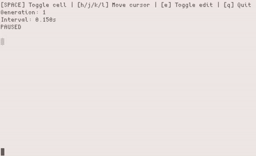

life-cli
========

A terminal-based implementation of Conway's Game of Life written in Python. It simulates the classic cellular automaton in a toroidal grid and includes an interactive editor mode for creating custom patterns directly in the terminal.

<p align="center">
  
</p>

Features
========

- Real time controls: Pause, resume and adjust simulation speed.
- Interactive editor: Pause the simulation and toggle cells
- Toroidal grid: The edges wrap around
- Zero dependencies: Built entirely with Python's standard library.

Usage
=====

This application uses `sys.stdin`, `tty` and `termios` and thus runs natively on Unix-like environments without requiring external packages.

```bash
git clone https://github.com/vrncff/life-cli.git
cd life-cli
python main.py # For custom grid size, use flags -W and -H, default is 60x15.
```

Controls
--------

**Normal mode:**

- SPACE: Play/Pause
- +/-: Increase/Decrease simulation speed
- r: Generate a random grid state
- e: Enter editor mode
- q: Quit

**Editor mode:** 

- h, j, k, l: Move cursor (left, down, up, right)
- SPACE: Toggle the current cells (alive/dead)
- a,s: Select previous/next pattern
- r: Rotate current pattern
- e: Exit editor mode
- q: Quit

How It Works
============

The project is structured to separate mathematical logic from state management and the user interface:

- `core.py`: Contains stateless functional logic for grid creation, neighbor counting and application of the game's rules without mutating the input state.
- `engine.py`: The `LifeEngine` class acts as the controller. It maintains the current generation state, manages the simulation tick rate and coordinates the switch between simulation and editor modes.
- `ui_terminal.py`: Handles terminal rendering and intercepts keystrokes using `sys.stdin` and `termios`.
- `patterns.py`: Defines relative coordinate matrices for classic Game of Life patterns.

To-Do
=====

- [x] Spawn predefined patterns in the grid.
- [x] Make the grid dimensions adjustable
- [ ] Load initial grid states from a text file.
